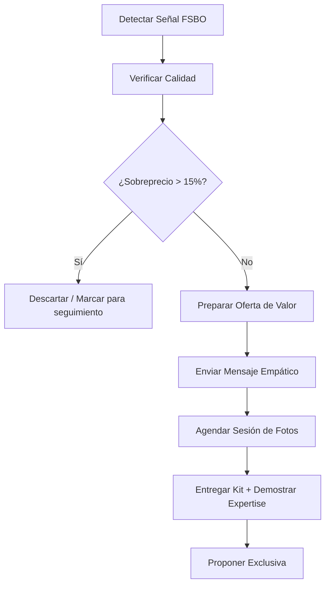
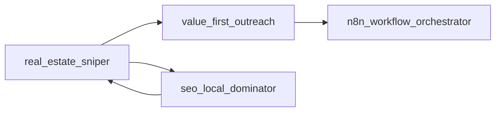

# 🎯 Real Estate Sniper - El Cazador de Oportunidades

> **Filosofía:** No buscamos propiedades, cazamos señales. No perseguimos clientes, atraemos vendedores con valor primero.

---

## 1. PROPÓSITO

Identificar propiedades y clientes potenciales basándose en **señales activas del mercado**, eliminando el ruido de las listas frías y priorizando oportunidades de alta conversión.

### Diferenciador Clave

| Enfoque Tradicional | Enfoque Sniper |
|---------------------|----------------|
| Llamadas frías masivas | Contacto caliente con valor |
| Listas compradas | Señales detectadas en tiempo real |
| "¿Quiere vender?" | "Le traigo algo gratis para su propiedad" |
| Volumen sobre calidad | Precisión quirúrgica |

---

## 2. ESTRATEGIA "MEDIA-FIRST" 📸

> **Regla de Oro:** El primer contacto NUNCA es para pedir la venta. Es para ENTREGAR valor tangible.

### Kit de Marketing Visual Gratuito

Ofrecer a vendedores FSBO (For Sale By Owner) un paquete de marketing profesional sin costo:

```
┌─────────────────────────────────────────────┐
│  🎁 KIT DE MARKETING VISUAL GRATUITO        │
├─────────────────────────────────────────────┤
│  ✓ 10 Fotos HDR profesionales               │
│  ✓ Tour Virtual 360° (Matterport-style)     │
│  ✓ Video walkthrough de 60 segundos         │
│  ✓ Plano 2D de distribución                 │
│  ✓ Análisis de precio de mercado            │
└─────────────────────────────────────────────┘
```

### Flujo de Captación Media-First



---

## 3. FUENTES DE DATOS Y SCRAPERS 🔍

### 3.1 Señales de Alta Intención

El agente debe buscar estas señales que indican vendedores directos:

| Señal | Fuente | Prioridad |
|-------|--------|-----------|
| "Dueño Vende" | Google Maps, portales | 🔴 Alta |
| "Trato Directo" | MercadoLibre, OLX | 🔴 Alta |
| "Sin Inmobiliaria" | Facebook Marketplace | 🔴 Alta |
| "Vendo Urgente" | Clasificados locales | 🟡 Media |
| "Oportunidad" | Instagram, Stories | 🟡 Media |
| Propiedades +90 días publicadas | Portales históricos | 🟢 Baja |

### 3.2 Queries de Búsqueda para Scrapers

```python
# Patrones de búsqueda para N8N + Scraper
SEARCH_QUERIES = [
    # Google Maps
    "dueño vende casa {zona}",
    "trato directo departamento {zona}",
    "vendo directo propiedad {zona}",
    
    # Portales inmobiliarios
    "site:mercadolibre.com.uy 'dueño vende' {zona}",
    "site:gallito.com.uy 'trato directo' {zona}",
    "site:infocasas.com.uy 'sin comisión' {zona}",
    
    # Redes sociales
    "inurl:facebook.com/marketplace 'vendo casa' {zona}",
    "site:instagram.com 'vendo departamento' {zona}"
]
```

### 3.3 Estructura de Datos Capturados

```typescript
interface ProspectProperty {
  // Identificación
  id: string;
  source: 'google_maps' | 'mercadolibre' | 'facebook' | 'infocasas' | 'gallito';
  originalUrl: string;
  capturedAt: Date;
  
  // Propiedad
  address: string;
  neighborhood: string;
  city: string;
  propertyType: 'casa' | 'apartamento' | 'terreno' | 'local';
  bedrooms?: number;
  bathrooms?: number;
  area?: number;
  
  // Precio y Análisis
  listedPrice: number;
  marketPrice?: number; // Estimado por comparables
  priceGap?: number; // Diferencia porcentual
  daysOnMarket: number;
  
  // Contacto
  ownerName?: string;
  phone?: string;
  whatsapp?: string;
  email?: string;
  
  // Scoring
  qualityScore: number; // 1-100
  urgencySignals: string[];
  disqualifyReasons?: string[];
}
```

---

## 4. FILTRADO INTELIGENTE 🎚️

### 4.1 Criterios de Descarte Automático

> **Regla:** No perder tiempo en propiedades con baja probabilidad de cierre.

```python
def should_disqualify(property: ProspectProperty) -> tuple[bool, str]:
    """
    Retorna (True, razón) si debe descartarse.
    """
    
    # ❌ Sobreprecio excesivo (>15% del mercado)
    if property.priceGap and property.priceGap > 15:
        return True, f"Sobreprecio del {property.priceGap}%"
    
    # ❌ Sin información de contacto
    if not property.phone and not property.whatsapp:
        return True, "Sin datos de contacto"
    
    # ❌ Inmobiliaria disfrazada
    AGENCY_PATTERNS = ['inmobiliaria', 'real estate', 'propiedades sa']
    if any(p in property.ownerName.lower() for p in AGENCY_PATTERNS):
        return True, "Es inmobiliaria, no FSBO"
    
    # ❌ Propiedad con problemas legales
    LEGAL_RED_FLAGS = ['sucesión', 'juicio', 'embargo', 'ocupada']
    description = property.description.lower()
    for flag in LEGAL_RED_FLAGS:
        if flag in description:
            return True, f"Problema legal detectado: {flag}"
    
    return False, ""
```

### 4.2 Scoring de Calidad

```python
def calculate_quality_score(property: ProspectProperty) -> int:
    """
    Calcula un score de 1-100 basado en señales de calidad.
    """
    score = 50  # Base
    
    # Señales positivas
    if property.priceGap and property.priceGap < 0:
        score += 20  # Subvaluada
    if 'urgente' in property.description.lower():
        score += 15
    if property.daysOnMarket > 60:
        score += 10  # Vendedor probablemente frustrado
    if property.whatsapp:
        score += 10  # Más fácil contactar
    if 'negociable' in property.description.lower():
        score += 5
    
    # Señales negativas
    if property.priceGap and property.priceGap > 10:
        score -= 15
    if property.daysOnMarket < 7:
        score -= 10  # Recién publicada, menos urgencia
    
    return max(1, min(100, score))
```

---

## 5. WORKFLOW N8N RECOMENDADO

```yaml
# n8n-workflow: real_estate_sniper_pipeline
name: "🎯 Sniper - Captación FSBO"
trigger: 
  - cron: "0 8 * * *"  # Diario a las 8am
  - webhook: manual_trigger

nodes:
  1_scrape_sources:
    type: HTTP Request
    config:
      sources:
        - mercadolibre_scraper
        - google_maps_scraper
        - facebook_marketplace_scraper
    output: raw_listings[]

  2_parse_and_enrich:
    type: Code (JavaScript)
    config:
      - Extract contact info
      - Normalize addresses
      - Estimate market price via Supabase comparables
    output: enriched_listings[]

  3_filter_and_score:
    type: Code (Python)
    config:
      - Apply disqualification rules
      - Calculate quality score
      - Sort by score DESC
    output: qualified_leads[]

  4_deduplicate:
    type: Supabase
    config:
      - Check if already contacted
      - Merge duplicate properties
    output: new_leads[]

  5_prepare_outreach:
    type: value_first_outreach
    config:
      - Generate personalized message
      - Select channel (WhatsApp/Email)
    output: ready_to_send[]

  6_queue_messages:
    type: Supabase Insert
    config:
      table: outreach_queue
      status: pending
```

---

## 6. MÉTRICAS DE ÉXITO

| Métrica | Objetivo | Frecuencia |
|---------|----------|------------|
| Leads nuevos/día | 10-20 | Diario |
| Tasa de contacto válido | >70% | Semanal |
| Tasa de respuesta al Kit | >25% | Semanal |
| Conversión a exclusiva | >5% | Mensual |
| Costo por lead | <$2 USD | Mensual |

---

## 7. INTEGRACIÓN CON OTROS SKILLS



- **→ value_first_outreach**: Envía los leads calificados para redacción de mensajes
- **→ n8n_workflow_orchestrator**: Ejecuta el pipeline de captación
- **← seo_local_dominator**: Recibe leads orgánicos de la web

---

## 8. CHECKLIST DE IMPLEMENTACIÓN

- [ ] Configurar scrapers para cada fuente
- [ ] Crear tabla `prospect_properties` en Supabase
- [ ] Implementar función de estimación de precio de mercado
- [ ] Crear workflow N8N de captación diaria
- [ ] Configurar alertas de leads de alta calidad
- [ ] Integrar con `value_first_outreach` para mensajería

---

> **@Jules TODO:** Refactorizar el scoring system para usar ML simple basado en conversiones históricas.
