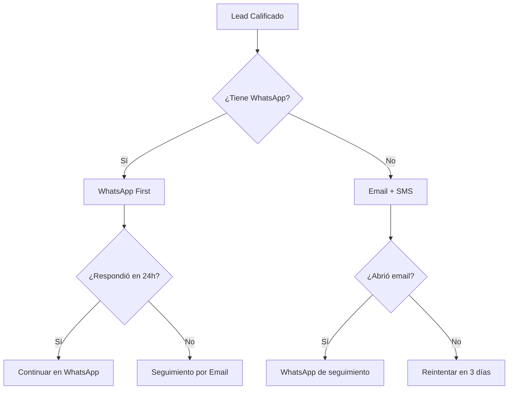
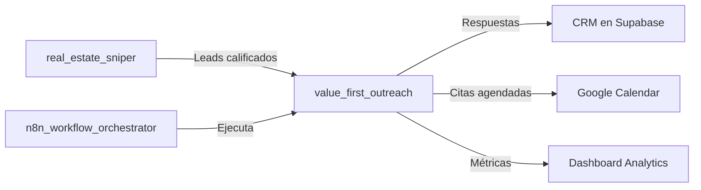

# 💬 Value First Outreach - El Comunicador Empático

> **Regla de Oro:** Nunca vendas en el primer mensaje. El que da primero, gana la confianza.

---

## 1. PROPÓSITO

Redactar mensajes que el cliente **quiera leer y responder**, eliminando el rechazo típico de la venta fría mediante la entrega de valor tangible antes de cualquier solicitud.

### El Problema que Resolvemos

```
❌ MENSAJE TÍPICO (SPAM)
"Hola, soy de Inmobiliaria X. ¿Está interesado en vender su propiedad? 
Tenemos compradores esperando. Llámeme al..."

❌ RESULTADO: Ignorado, bloqueado, o respuesta hostil
```

```
✅ MENSAJE VALUE-FIRST
"Hola María, vi tu casa en Carrasco con ese jardín increíble. 
Trabajo con un fotógrafo profesional y me gustaría ofrecerte 
un set de fotos HDR gratis para tu publicación. Sin compromiso. 
¿Te interesa?"

✅ RESULTADO: Curiosidad, apertura, conversación
```

---

## 2. PRINCIPIOS FUNDAMENTALES

### 2.1 La Regla del 3-1

> Por cada mensaje que pidas algo, debes haber dado **3 cosas de valor** primero.

```
Mensaje 1: 📸 Oferta de Kit de Fotos (VALOR)
Mensaje 2: 📊 Análisis de precio de mercado (VALOR)
Mensaje 3: 📍 Guía de la zona para compradores (VALOR)
Mensaje 4: 🤝 Propuesta de colaboración (PEDIDO)
```

### 2.2 Personalización Real, No Fake

| ❌ Personalización Falsa | ✅ Personalización Real |
|--------------------------|-------------------------|
| "Estimado propietario" | "Hola María" |
| "Su propiedad" | "Tu casa en Av. Italia 2340" |
| "Excelente ubicación" | "A 3 cuadras del Punta Carretas Shopping" |
| "Buena inversión" | "Con ese jardín de 200m², perfecta para familias" |

### 2.3 Canales y Timing



---

## 3. TEMPLATES DE MENSAJES

### 3.1 WhatsApp - Primer Contacto (Value-First)

```
👋 Hola {{ownerName}},

Vi tu publicación de la {{propertyType}} en {{address}}. 
{{personalDetail}}

Trabajo con un equipo de fotógrafos y ofrecemos un **Kit de Marketing Visual gratuito** para propietarios que venden directo:

📸 10 fotos HDR profesionales
🎥 Video walkthrough de 60 seg
🏠 Tour virtual 360°

**Sin costo, sin compromiso.** Solo queremos ayudarte a destacar tu propiedad.

¿Te interesa? Puedo coordinar una sesión esta semana.

Saludos,
{{agentName}}
```

**Variables a inyectar desde N8N:**
- `{{ownerName}}`: Nombre del propietario
- `{{propertyType}}`: casa / apartamento / etc.
- `{{address}}`: Dirección específica
- `{{personalDetail}}`: Detalle personal observado (ej: "Ese jardín con la piscina se ve increíble")
- `{{agentName}}`: Nombre del agente

---

### 3.2 WhatsApp - Seguimiento (Si no responde)

**Día 3:**
```
👋 {{ownerName}}, ¿viste mi mensaje anterior?

Mientras tanto, preparé un **análisis rápido de precios** de tu zona. 
Propiedades similares en {{neighborhood}} se están vendiendo entre 
${{minPrice}} y ${{maxPrice}} USD.

¿Te gustaría el informe completo? Es gratis 📊
```

**Día 7:**
```
🏠 Último intento, {{ownerName}}.

Vi que tu propiedad lleva {{daysOnMarket}} días publicada. 
A veces el problema no es el precio, sino cómo se presenta.

Te dejo una guía rápida con 5 tips para mejorar tu publicación:
[LINK a guía en el sitio web]

Si en algún momento necesitas ayuda profesional, aquí estoy.
¡Éxitos con la venta! 🤞
```

---

### 3.3 Email - Primer Contacto (Más formal)

**Subject:** 📸 Fotos profesionales gratis para tu propiedad en {{address}}

```html
Hola {{ownerName}},

Mi nombre es {{agentName}} y me especializo en ayudar a propietarios 
a vender sus propiedades de forma más rápida y al mejor precio.

Vi tu publicación de la {{propertyType}} en {{address}} y 
noté que {{observedIssue}}.

Me gustaría ofrecerte, **sin ningún costo ni compromiso**, un 
Kit de Marketing Visual profesional que incluye:

✅ 10 fotografías HDR de alta calidad
✅ Video walkthrough de 60 segundos
✅ Tour virtual 360° interactivo
✅ Plano 2D de distribución

Este kit normalmente tiene un valor de ${{kitValue}} USD, pero 
lo ofrezco gratis a propietarios que venden directo como tú.

¿Por qué? Porque creo que el mejor marketing es demostrar lo que 
podemos hacer, no solo decirlo.

Si te interesa, responde este email o escríbeme al {{whatsapp}}.

Saludos cordiales,

{{agentName}}
{{agentTitle}}
{{agencyName}}
{{agentPhone}}
```

**Variables adicionales:**
- `{{observedIssue}}`: "Las fotos actuales no muestran todo el potencial del jardín"
- `{{kitValue}}`: Valor percibido del kit (ej: "350")

---

### 3.4 Email - Análisis de Precio (Value-Add)

**Subject:** 📊 Análisis de mercado para {{address}} - ¿El precio es correcto?

```html
Hola {{ownerName}},

Me tomé la libertad de preparar un análisis de mercado para 
tu propiedad en {{address}}.

📍 **Tu zona: {{neighborhood}}**

| Métrica | Tu Propiedad | Promedio Zona |
|---------|--------------|---------------|
| Precio/m² | ${{pricePerSqm}} | ${{avgPricePerSqm}} |
| Días en mercado | {{daysOnMarket}} | {{avgDaysOnMarket}} |
| Competidores activos | - | {{competitorCount}} |

{{priceAnalysis}}

Este análisis es **cortesía mía**, sin ningún compromiso.

Si quieres el informe completo con comparables detallados, 
solo responde este email.

Saludos,
{{agentName}}
```

**Variable `{{priceAnalysis}}`:**
- Si precio < mercado: "Tu precio está bien posicionado. Con mejor marketing, podrías atraer más interesados."
- Si precio > mercado: "Tu precio está {{priceGap}}% por encima del promedio. Esto podría estar alargando el tiempo de venta."

---

## 4. ORQUESTACIÓN CON N8N

### 4.1 Workflow de Mensajería Automatizada

```yaml
# n8n-workflow: value_first_outreach_pipeline
name: "💬 Outreach Empático Automático"
trigger:
  - supabase: insert on outreach_queue
  - cron: "0 9,14,18 * * *"  # 9am, 2pm, 6pm

nodes:
  1_fetch_pending:
    type: Supabase
    config:
      table: outreach_queue
      filter: status = 'pending'
      limit: 20
    output: pending_leads[]

  2_personalize_message:
    type: Code (JavaScript)
    config:
      - Select template based on lead stage
      - Inject personalization variables
      - Add observed details from property
    output: personalized_messages[]

  3_select_channel:
    type: Switch
    conditions:
      - has_whatsapp: route to whatsapp_node
      - has_email_only: route to email_node
      - has_both: route to whatsapp_node (priority)

  4a_send_whatsapp:
    type: WhatsApp Business API
    config:
      template: value_first_intro
      variables: from personalized_messages
    output: whatsapp_result

  4b_send_email:
    type: Gmail / SendGrid
    config:
      template_id: value_first_email
      variables: from personalized_messages
    output: email_result

  5_log_and_update:
    type: Supabase
    config:
      table: outreach_log
      action: insert
      update: outreach_queue.status = 'sent'

  6_schedule_followup:
    type: Supabase
    config:
      table: outreach_queue
      action: insert
      data:
        lead_id: current.lead_id
        stage: 'followup_1'
        scheduled_for: now() + 3 days
        status: pending
```

### 4.2 Tabla Supabase: outreach_queue

```sql
CREATE TABLE outreach_queue (
  id UUID PRIMARY KEY DEFAULT gen_random_uuid(),
  lead_id UUID REFERENCES prospect_properties(id),
  stage TEXT NOT NULL DEFAULT 'initial', -- initial, followup_1, followup_2, final
  channel TEXT NOT NULL, -- whatsapp, email, sms
  template_id TEXT NOT NULL,
  personalization JSONB,
  scheduled_for TIMESTAMPTZ DEFAULT now(),
  status TEXT DEFAULT 'pending', -- pending, sent, failed, responded
  created_at TIMESTAMPTZ DEFAULT now(),
  sent_at TIMESTAMPTZ,
  response_at TIMESTAMPTZ,
  response_type TEXT -- positive, negative, neutral, no_response
);

-- Índice para el cron job
CREATE INDEX idx_outreach_pending ON outreach_queue(status, scheduled_for) 
WHERE status = 'pending';
```

---

## 5. PERSONALIZACIÓN AVANZADA

### 5.1 Detectar Detalles Personales

El agente debe buscar en la publicación original detalles que demuestren que **realmente vio la propiedad**:

```javascript
function extractPersonalDetails(listing) {
  const details = [];
  const description = listing.description.toLowerCase();
  
  // Detectar características destacables
  if (description.includes('jardín') || description.includes('patio')) {
    details.push('Ese jardín/patio se ve perfecto para reuniones familiares');
  }
  if (description.includes('piscina')) {
    details.push('La piscina es un diferencial enorme para familias');
  }
  if (description.includes('parrillero') || description.includes('bbq')) {
    details.push('El parrillero es un must para el mercado uruguayo');
  }
  if (description.includes('vista') || description.includes('view')) {
    details.push('Esa vista es difícil de encontrar en la zona');
  }
  if (listing.photos && listing.photos.length > 5) {
    details.push('Me gustó cómo mostraste los espacios en las fotos');
  }
  
  // Detectar ubicación especial
  if (listing.nearbyPOIs) {
    const poi = listing.nearbyPOIs[0];
    details.push(`Súper bien ubicada, cerca de ${poi.name}`);
  }
  
  return details[0] || 'Tiene muy buena pinta la propiedad';
}
```

### 5.2 Adaptar Tono por Segmento

| Segmento | Tono | Ejemplo de Saludo |
|----------|------|-------------------|
| Vendedor urgente | Directo, empático | "Sé que vender rápido es prioridad..." |
| Propietario de lujo | Formal, exclusivo | "Estimado/a {{name}}, me especializo en propiedades premium..." |
| FSBO frustrado (+60 días) | Comprensivo, solucionador | "Entiendo la frustración de no recibir ofertas serias..." |
| Primera vez vendiendo | Educativo, tranquilizador | "Vender tu primera propiedad puede ser abrumador..." |

---

## 6. MÉTRICAS Y OPTIMIZACIÓN

### 6.1 KPIs de Mensajería

| Métrica | Objetivo | Cómo Medir |
|---------|----------|------------|
| Tasa de apertura (Email) | >40% | SendGrid/Gmail analytics |
| Tasa de respuesta | >25% | Supabase outreach_log |
| Tiempo a primera respuesta | <24h | Timestamps en log |
| Sentimiento de respuesta | >80% positivo/neutral | Clasificación manual o AI |
| Conversión a cita | >10% | Supabase conversions |

### 6.2 A/B Testing Automático

```javascript
// En N8N: Seleccionar variante de mensaje
function selectMessageVariant(lead) {
  const variants = ['A', 'B'];
  const hash = lead.id.charCodeAt(0) % 2;
  return variants[hash];
}

// Después de 100 envíos, comparar:
// - Tasa de respuesta por variante
// - Sentimiento de respuestas
// - Conversión a citas
```

---

## 7. REGLAS DE NO-SPAM

### 7.1 Límites de Contacto

```python
MAX_ATTEMPTS_PER_LEAD = 4  # Máximo 4 intentos totales
MIN_DAYS_BETWEEN_MESSAGES = 3  # Espaciar al menos 3 días
COOLDOWN_AFTER_NEGATIVE = 30  # 30 días si responde negativamente
PERMANENT_BLOCK_KEYWORDS = ['no me contacten', 'bloquear', 'reportar']

def can_contact(lead):
    attempts = count_attempts(lead.id)
    last_contact = get_last_contact(lead.id)
    last_response = get_last_response(lead.id)
    
    if attempts >= MAX_ATTEMPTS_PER_LEAD:
        return False, "Máximo de intentos alcanzado"
    
    if last_contact and (now() - last_contact).days < MIN_DAYS_BETWEEN_MESSAGES:
        return False, "Muy pronto para siguiente contacto"
    
    if last_response and last_response.type == 'negative':
        if (now() - last_response.date).days < COOLDOWN_AFTER_NEGATIVE:
            return False, "En período de enfriamiento"
    
    if any(kw in (last_response.text or '').lower() for kw in PERMANENT_BLOCK_KEYWORDS):
        return False, "Solicitó no ser contactado"
    
    return True, ""
```

### 7.2 Horarios de Envío

```
✅ Horarios permitidos:
   - Lunes a Viernes: 9:00 - 20:00
   - Sábados: 10:00 - 14:00
   - Domingos: NO ENVIAR

✅ Mejores horarios (mayor apertura):
   - 9:00 - 10:00 (inicio del día)
   - 14:00 - 15:00 (post-almuerzo)
   - 18:00 - 19:00 (fin de jornada)
```

---

## 8. INTEGRACIÓN CON OTROS SKILLS



---

## 9. CHECKLIST DE IMPLEMENTACIÓN

- [ ] Crear templates de WhatsApp Business API
- [ ] Configurar integración con SendGrid/Gmail
- [ ] Crear tabla `outreach_queue` en Supabase
- [ ] Crear tabla `outreach_log` para tracking
- [ ] Implementar workflow N8N de envío
- [ ] Configurar A/B testing automático
- [ ] Crear dashboard de métricas en Supabase
- [ ] Entrenar al equipo en interpretación de respuestas

---

> **@Jules TODO:** Implementar clasificación automática de sentimiento de respuestas usando OpenAI API para escalar el análisis.
